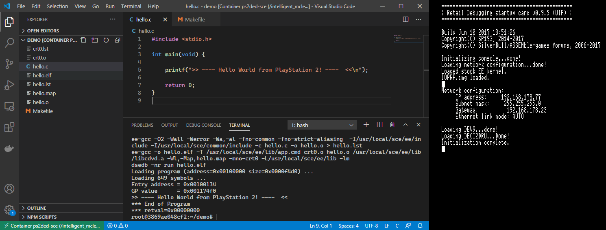

# PlayStation 2 DevEnv for Docker

A toolchain host for the Sony PlayStation 2 SDK, using a [&#128279;Retail Debugging Startup Cart (PSX-Place)](https://www.psx-place.com/threads/retail-debugging-startup-card.14027/) for on-target debugging on retail systems.

**See also:** [**ps2ded-vscode**](https://github.com/islandcontroller/ps2ded-vscode), a VS Code Devcontainer for PS2DED

## System Requirements

- Docker Desktop (Windows host) or Docker Server (Linux host)
- Retail PlayStation 2 w/ Ethernet interface (tested on `SCPH-77004`)
- uLaunchELF (tested with v4.43a)

## Preparation

This repository does not and will not include third-party tools. They need to be sourced separately.

1. Source a 2005 Sony PlayStation 2 SDK disk image
2. Install the SDK on a Windows machine, and pack the `sce` folder into a compressed ZIP archive `sce.zip`
3. Move the archive into the `install/` directory of this repo
4. Download the DSNET tool set from the RDB project: [&#128279;PSX-Place **(dsnet-bin.7z)**](https://www.psx-place.com/threads/retail-debugging-startup-card.14027/)
5. Place the 7zip archive into the `install/` folder as well

### Retail Debugging Startup Cart (RDB-UIF)

1. Download the binaries from the RDB project: [&#128279;PSX-Place **(RDB-095-bin.7z)**](https://www.psx-place.com/threads/retail-debugging-startup-card.14027/)
2. Transfer the following files to your system, e.g. using uLaunchELF's FTP server. Place them in a new folder on your memory card, e.g. `mc0:/RDB/`
    - `RDB-UIF.elf`
    - `thmon.irx`
3. Copy the following files from your SDK folder `sce/iop/modules/` into the same memory card location, as those listed above:
    - `sio2man.irx`
    - `IOPRP300.img` - rename this file to `IOPRP.img` on the memory card

## Building

To build the Docker image, open a shell session inside the cloned repo folder, and run:

    docker build -t ps2ded-sce .

Due to limitations of the Docker build system, this will leave behind an untagged image of the builder stage, with a size of around 3 GB. This dangling image can be removed.

### Image Size Optimization

You can limit the image size by removing unnecessary files and folders from the `sce.zip` archive, such as documentation or Windows tools. The minimum configuration consists of:

* `dsnet-bin.7z`: only requires `dsnetm` executable
* `sce.zip`: requires `sce/bin/`, `sce/common/`, `sce/ee/`, and `sce/iop/` folders

| Configuration | Image Size |
|---------------|------------|
| Full          | ca. 2 GB   |
| Minimal       | ca. 250 MB |

## Usage

The container provides access to the PlayStation 2 SDK compiler and debugger toolchain, as well as all related header files. The DSNET server can be accessed from other tools, similar to a *TOOL* PlayStation 2, via the exposed network port `8510`. In order to launch a new session, use:

    docker run -v <workspace>:/work -e PS2IP=<ipaddr> --rm -it ps2ded-sce

Load the *RDB-UIF* executable on your PlayStation and start the DSNET server by running the following command inside the container shell. The script will use the IP address specified in `$PS2IP`.

    start_dsnetm

The script will automatically start up an IOP module server, and dump the register contents of both processors to check the connection.

### Volume mounts from a Windows host

Due to incompatibilities between the 32-bit libraries used by SCE tools and the volume driver for Windows mounts, `ee-gcc` and the like will fail trying to access files in the `/work` directory.

A workaround is provided with the `sync_work` script. This script will copy the `/work` folder to the container-local filesystem, and synchronize outgoing changes back to the Windows host using `rsync`. Synchronization is repeated every 5 seconds, and checks file contents for changes using a CRC.

**Note:** This will keep overriding any changes made on the Windows host, except for the `_transfer` folder.

    sync_work ~
    cd ~/work

In order to transfer files from the Windows host to the container, create a `_transfer` folder in the work directory. Any changes made to the files contained in this folder from within the container will, again be overwritten.

## Configuration

Use Docker environment variable arguments when launching a new container to configure the IP address of the target device:

    -e PS2IP=192.168.1.100